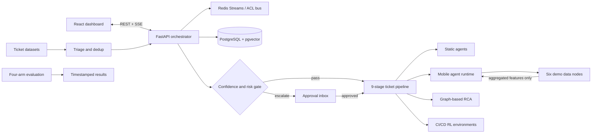

# T2D-MAS — Ticket-to-Deployment Multi-Agent System

T2D-MAS is a course-project prototype that explores how a multi-agent system can move a software ticket through triage, investigation, implementation, testing, review, and deployment. It combines a nine-stage orchestration pipeline with auditable decisions, policy gates, optional mobile agents, and a small React dashboard.

> **Course prototype:** this repository is for a group assignment and demonstrations. It is not a production deployment platform or a security boundary for untrusted code.

## Project goals

- Compare rule-based, single-agent, static multi-agent, and mobile multi-agent approaches.
- Demonstrate ticket deduplication, severity prediction, root-cause ranking, CI test prioritization, and canary deployment decisions.
- Make human approval, auditability, and data locality visible in the pipeline.
- Produce seeded, repeatable classroom experiments and report artifacts.

## Architecture



The system uses the autonomy rule `confidence >= tau AND risk <= risk_max`; otherwise, it escalates. Merge and full-deployment actions require an explicit `human_approved=True` flag. Agent actions are written to an append-only audit log, and the mobile demo returns allowlisted aggregate fields rather than raw node data.

## Repository layout

| Path | Purpose |
|---|---|
| `agents/` | Agent interface, Redis Streams message bus, Contract Net assignment, mobile runtime, policy checks, and orchestrator |
| `data/` | PostgreSQL schema, ticket loaders, preprocessing, dataset statistics, and mock enterprise APIs |
| `triage/` | Local embeddings, FAISS duplicate search, severity classifiers, and autonomy gate |
| `rca/` | PyTorch Geometric service graph builder, GraphSAGE ranker, explanations, and baseline |
| `envs/` | Gymnasium CI test-prioritization and canary-deployment environments; SB3 training/evaluation |
| `eval/` | Four-arm benchmark, metrics, security injections, and BAB 9.4 report generator |
| `frontend/` | React + Tailwind + Recharts delivery workspace with nine views, ticket conversations, review gates, and SSE updates |
| `docker-compose.yml` | Orchestrator, six demo nodes, Redis, and PostgreSQL/pgvector |

Each module has its own README and `requirements.txt`. The root `requirements.txt` installs the full course-project stack, including the larger ML/RL dependencies. To keep installation smaller, install only the requirements for the module you plan to run.

## Quick start: backend demo

Requirements: Docker with the Compose plugin.

For the presentation flow, prepared sample ticket, review prompts, and screen-by-screen explanations, see the [live demo guide](deliverables/T2D-MAS-Live-Demo-Guide.md).

```sh
docker compose up --build
```

If host port 8000 is already in use, run Compose on another host port. For PowerShell:

```powershell
$env:ORCHESTRATOR_PORT = "8001"
docker compose up --build
```

Then use `http://localhost:8001` for the orchestrator. The container continues listening on port 8000.

The services expose:

- Orchestrator API and OpenAPI UI: `http://localhost:8000` and `http://localhost:8000/docs`
- Health check: `http://localhost:8000/health`
- Pending approvals: `http://localhost:8000/approvals`
- Server-sent events: `http://localhost:8000/events`

The demo API can create tickets, inspect approval requests, publish/read Redis-backed messages, and submit a signed mobile migration bundle. The dashboard's Run a ticket screen walks through nine local agent stages; Agent conversations shows live ACL handoffs, Contract Net bids, decisions, and recipients; Ticket history shows masked ticket inputs and timestamped outputs in Postgres. See [`agents/README.md`](agents/README.md) and the [agent task and capability catalog](agents/AGENT_CATALOG.md) for routes and prototype boundaries. PostgreSQL initializes from `data/schema.sql` when its volume is first created.

To stop the demo:

```sh
docker compose down
```

## Run the dashboard

In a separate terminal, with the backend running:

```sh
cd frontend
npm install
npm run dev
```

Open the Vite URL shown in the terminal (usually `http://localhost:5173`). The dashboard proxies API and SSE traffic to the local backend by default. Set `VITE_API_TARGET` to use another FastAPI host. Some seeded dashboard cards are local demo data; see [`frontend/README.md`](frontend/README.md).

## Python setup

Python 3.11 is the project target. Create and activate a virtual environment. For the full project environment:

```sh
python -m venv .venv
# Windows PowerShell: .venv\Scripts\Activate.ps1
# macOS/Linux: source .venv/bin/activate
python -m pip install -r requirements.txt
```

The full install can take longer and use more disk space because it includes PyTorch, Transformers, FAISS, and reinforcement-learning packages. For only the backend demo, run `python -m pip install -r agents/requirements.txt` instead.

Additional module dependencies:

```sh
python -m pip install -r data/requirements.txt
python -m pip install -r triage/requirements.txt
python -m pip install -r rca/requirements.txt
python -m pip install -r envs/requirements.txt
python -m pip install -r eval/requirements.txt
```

PyTorch Geometric installation can depend on the local PyTorch build; consult the official PyG installation guide if a matching wheel is needed.

## Data and privacy

The ticket loaders accept local exports and supported public sources. PostgreSQL loading is optional; Parquet export and preprocessing can run separately. For database loading, configure `DATABASE_URL` and apply the schema:

```sh
psql "$DATABASE_URL" -f data/schema.sql
```

Preprocessing masks common email, phone, and token patterns and assigns chronological train/validation/test splits. During mobile analysis, the demo keeps raw node data local and returns only allowlisted aggregates. See [`data/README.md`](data/README.md) for loader and mock API usage.

## Triage and model downloads

The separate `triage/` package requires no API key. Interactive Broker-Triage uses local rules by default and can optionally call OpenRouter when a key is configured; see [`agents/README.md`](agents/README.md). Embedding and transformer inference run locally. Public model downloads are disabled by default; cache the model locally or explicitly enable a one-time download with `TRIAGE_ALLOW_MODEL_DOWNLOAD=true`. The TF-IDF + calibrated LinearSVC baseline is local and does not require pretrained weights. See [`triage/README.md`](triage/README.md).

## Reproducible evaluation

The evaluation harness runs A0 (rule-based), A1 (single-agent), A2 (static MAS), and A3 (mobile MAS) over the same 100-ticket set using only seed 42. It writes a timestamped result folder containing configuration, per-ticket/per-stage CSVs, security injection results, descriptive summaries, BAB 9.4 Markdown, ROC data, and plots.

With GNU Make:

```sh
python -m pip install -r eval/requirements.txt
make eval
```

Equivalent command when GNU Make is unavailable:

```sh
python -m eval.runner --config eval/config.json --output-root results
```

The generated resource measurements are host observations; token counts and synthetic DORA/deployment outcomes are estimates or simulations. They are labelled in the outputs and explained in [`eval/README.md`](eval/README.md).

## Other experiments

Train and evaluate the reinforcement-learning policies:

```sh
python -m pip install -r envs/requirements.txt
python -m envs.train_rl --seed 42 --timesteps 20000 --output-dir rl_outputs
python -m envs.eval_rl --seed 42 --models-dir rl_outputs/models --output-dir rl_outputs/evaluation
```

The RCA module provides seeded synthetic incidents and tests for the numeric fixture. Data loaders and preprocessing commands are documented in their module READMEs.

## Checks

Run module checks independently:

```sh
python -m pytest agents/tests -q
python -m pytest triage/tests -q
python -m pytest rca/tests -q
python -m pytest envs/tests -q
```

## Known limitations

- Several comparisons use synthetic tickets, failure labels, deployment outcomes, and dashboard data; results are for coursework, not operational claims.
- Wall-clock, CPU, and memory measurements can vary by machine even with the fixed seed 42.
- The mobile runtime demonstrates signed bundles and container limits but does not provide a hardened isolation boundary for arbitrary code.
- The interactive pipeline records a complete prototype trace, but investigation is heuristic, implementation only drafts a request, QA has no connected CI runner, and deployment/monitoring do not connect to production systems. The ML, graph RCA, and RL experiments remain separate modules rather than one composed production workflow.
- The performance dashboard and conversation walkthrough are explicitly labeled examples. Ticket overview and human reviews use actual sandbox run state. Active runs are held in backend memory; persisted audit history survives a backend restart, but those old runs cannot be resumed.
